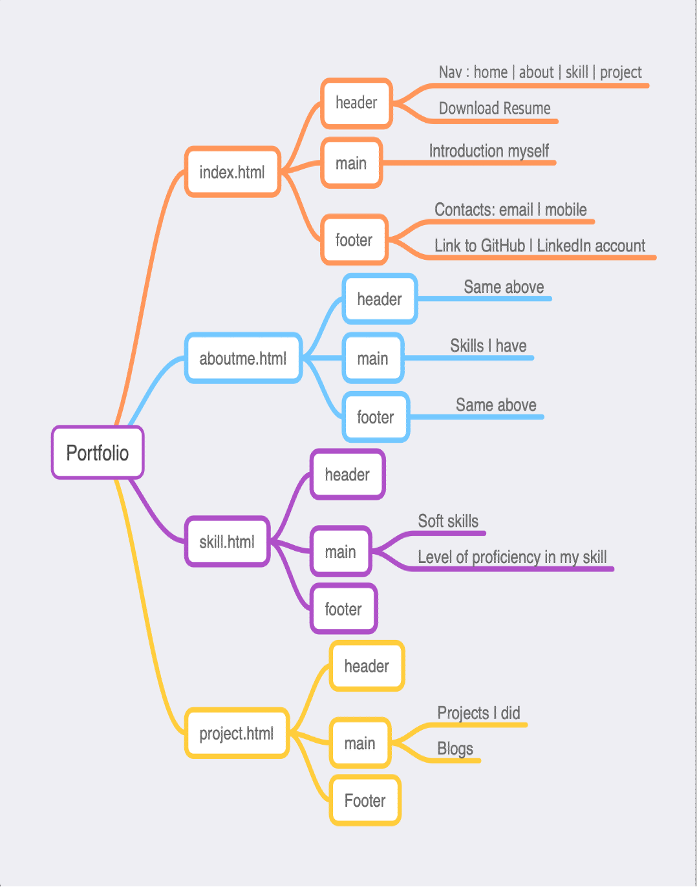
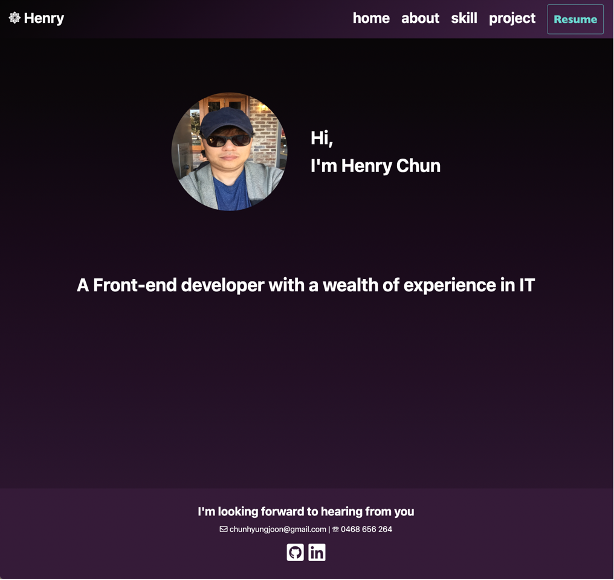
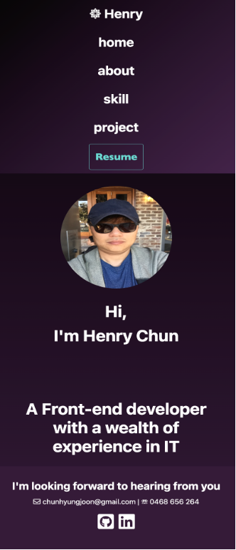
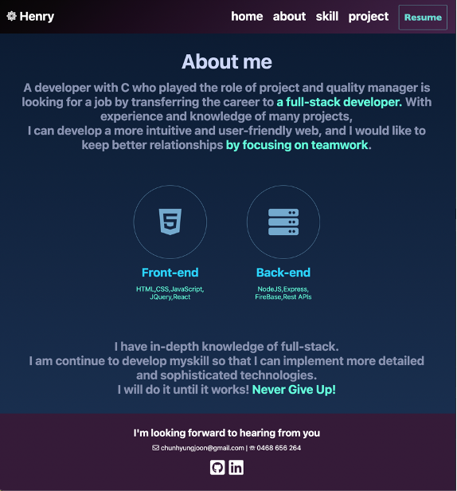
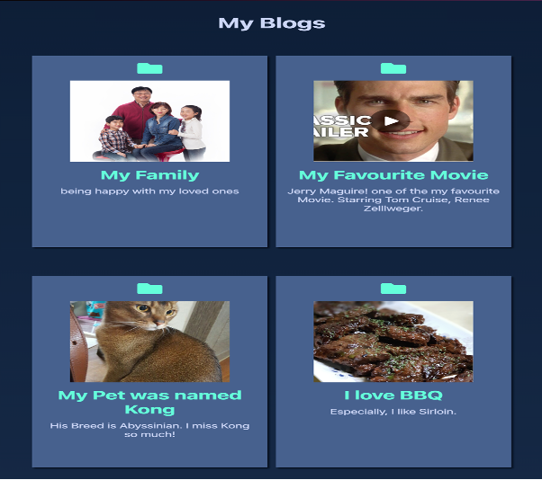
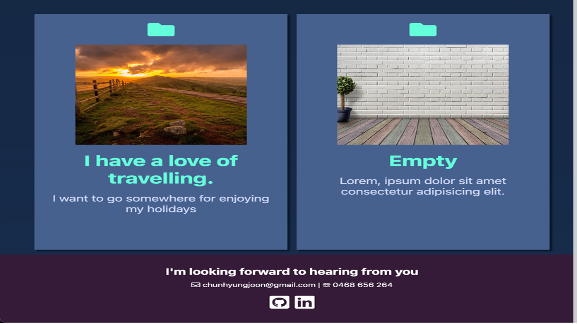
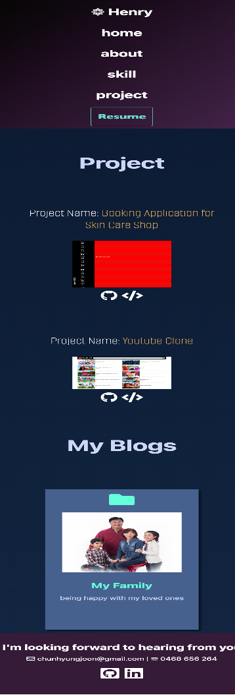

# ReadMe

Portfolio URL <https://t1a2-portfolio.web.app/>

<https://github.com/Henry229/CA_T1A2_Portfolio>

## Portfolio

### Purpose{.underline}

Reflect the knowledge and experience learned in class and show my
development ability, technical knowledge to prospective employer.

### Functionality / Features{.underline}

**Index.html**

- **A brief introduction to me.**

- **Get some icons from Font Awesome.**

- **Animation effect using transform.**

- **Semantic HTML elements are used.**

- [**https://t1a2-portfolio.web.app/index.html**](https://t1a2-portfolio.web.app/index.html)

**aboutme.html**

- **About my background in IT and skills I have.**

- **Header/Footer components are reused.**

- [**https://t1a2-portfolio.web.app/components/about/aboutme.html**](https://t1a2-portfolio.web.app/components/about/aboutme.html)

**skill.html**

- **Introduce my knowledge, experience, and level of proficiency in my
  skills.**

- **Used Grid on the skills table.**

- [**https://t1a2-portfolio.web.app/components/skill/skill.html**](https://t1a2-portfolio.web.app/components/skill/skill.html)

**project.html**

- **Show my project I did and my blog I created.**

- **Provided GitHub link and corresponding web page URL for the
  project.**

- **Link to my blogs when click blog images.**

- [**https://t1a2-portfolio.web.app/components/project/project.html**](https://t1a2-portfolio.web.app/components/project/project.html)

**All implemented Responsive layout.**

**Be able to download my Resume on the header.**

**Be able to link to my GitHub, LinkedIn on the footer.**

### Presentation Clip on YouTube{.underline}

- <https://youtu.be/RSUXuUMi0AA>

**Sitemap**

{width="7.48125in" height="9.522222222222222in"}

**Screenshots**

[Index.html]{.underline}

- laptop

{width="4.323593613298338in"
height="4.079099956255468in"}

- mobile \| tablet

{width="2.3443285214348206in"
height="5.4604243219597555in"}

[aboutme.html]{.underline}

- laptop

{width="3.9983027121609798in"
height="4.299669728783902in"}

- mobile \| tablet

{width="3.084284776902887in"
height="5.417912292213473in"}

[skill.html]{.underline}

- laptop

{width="3.0909503499562554in"
height="3.7425371828521437in"}

- mobile \| tablet

{width="2.7335640857392827in"
height="6.026246719160105in"}

[project.html]{.underline}

- laptop

{width="4.222941819772529in"
height="3.947761373578303in"}{width="4.280098425196851in"
height="3.7912489063867016in"}

{width="4.096474190726159in"
height="2.2897976815398073in"}

- mobile \| tablet

{width="2.56832895888014in"
height="7.546571522309711in"}

**Target Audience**

**This portfolio is for a potential employer to consider if my
qualification is enough or not.**

**Tech Stack**

HTML, CSS

development/build: Google Firebase Hosting
